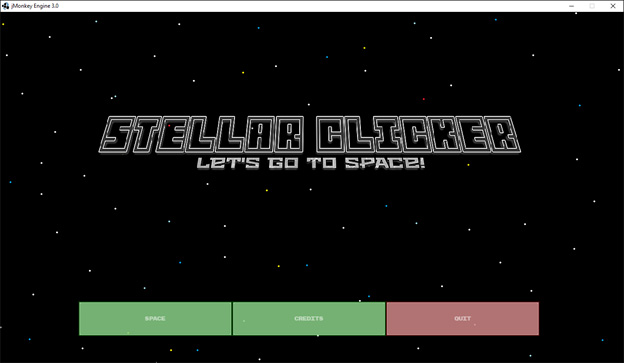
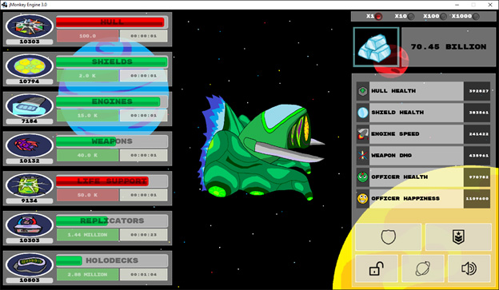
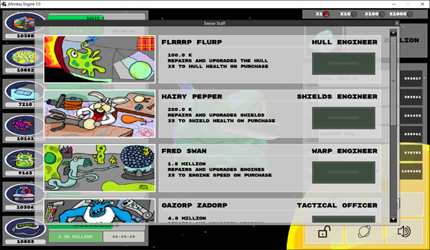

# Stellar Clicker

> [!WARNING]
> Archived and no longer maintained; kept for reference. Written in 2016 for Java 8 and jMonkeyEngine 3.0, as a project for jMonkeyEngine's NetBeans-based SDK. Both the engine version and the SDK are long out of date.

- [Stellar Clicker](#stellar-clicker)
  - [Overview](#overview)
    - [How it plays](#how-it-plays)
    - [What I built](#what-i-built)
  - [Screenshots](#screenshots)
  - [Credits](#credits)

## Overview

A space-themed idle clicker game written in Java with jMonkeyEngine. Class project for CSCI 412 at the University of Montana, spring 2016, built by a team of three: me, Matthew Dolan, and Alex Dunn.

**Tech:** Java 8, jMonkeyEngine 3.0, Nifty GUI, json-simple, JUnit

### How it plays

- Your ship has seven components (hull, shields, engines, weapons, life support, replicators, and holodecks); clicking one starts a timer that levels it up and raises one of the ship's statistics
- Components break and need repairs, and the senior staff you hire level and repair them for you, even while the game is closed
- Officers your ship attracts earn Clatinum, the game's currency, but claiming them resets your ship
- When you reopen the game, it catches up on everything that happened while you were away

### What I built

- The UI: screen states, Nifty GUI XML layouts, and a load screen that reads your save on a background thread while the progress bar updates on the main one
- The state and save systems (persistence touched about 90% of the code, since every class needed methods to read and write its own fields)
- Choosing and editing the art and audio assets
- Keeping the team's priorities straight: meetings, task assignment in Trello, and check-ins

Unit tests for the timers are on the `Testing` branch.

Related repos:

- [um-csci412-stellar-clicker-web](https://github.com/angiebrr/um-csci412-stellar-clicker-web): the game's website, blog, and forum, which I built for the same class
- [um-csci412-stellar-clicker-level-generator](https://github.com/angiebrr/um-csci412-stellar-clicker-level-generator): a small tool I wrote to generate per-level timing tables for the game

## Screenshots

## Credits

- **Sprite art:** Andrea Johnson
- **Vector icons:** Freepik, from [flaticon.com](https://www.flaticon.com)
- **Music:** "Cycles" by [Audionautix](https://audionautix.com)
- **UI components:** [Kenney](https://kenney.nl/assets)
